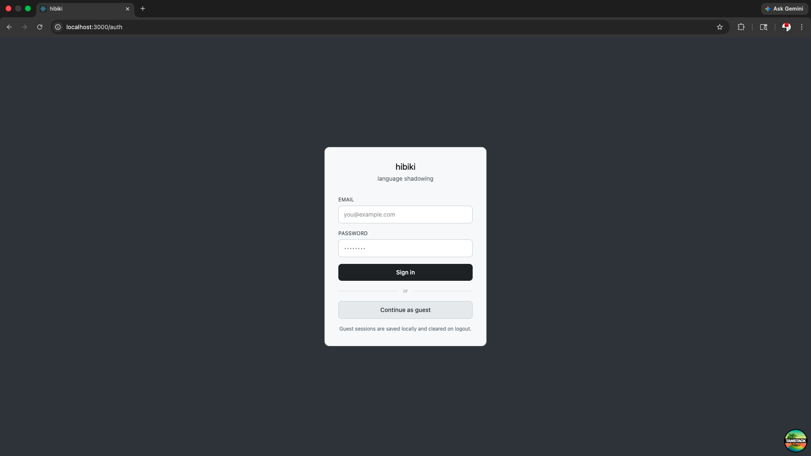
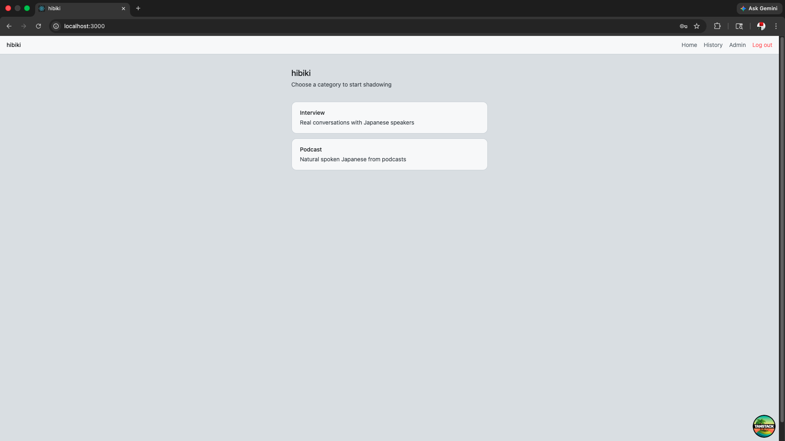
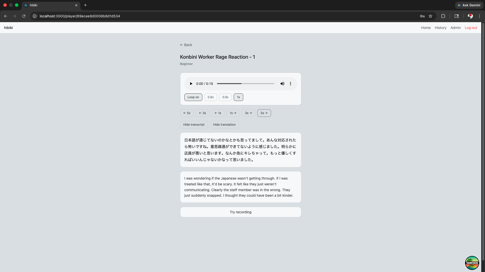
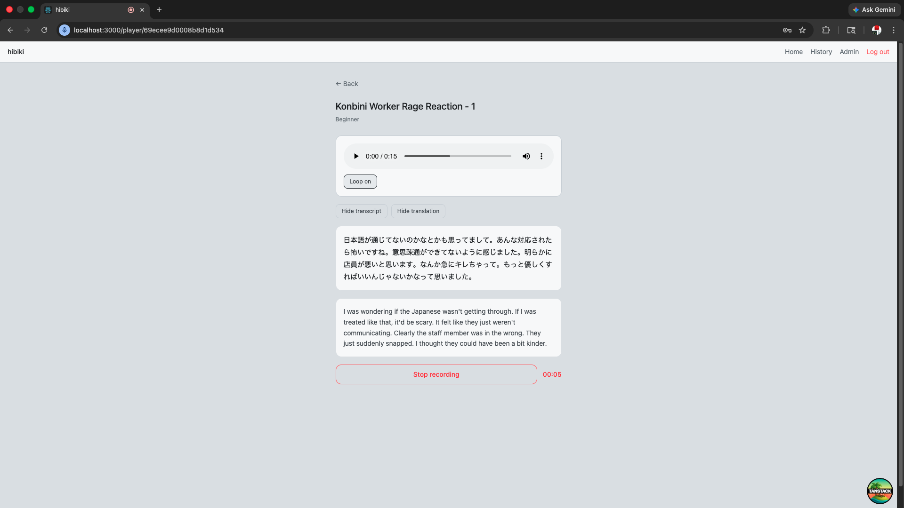
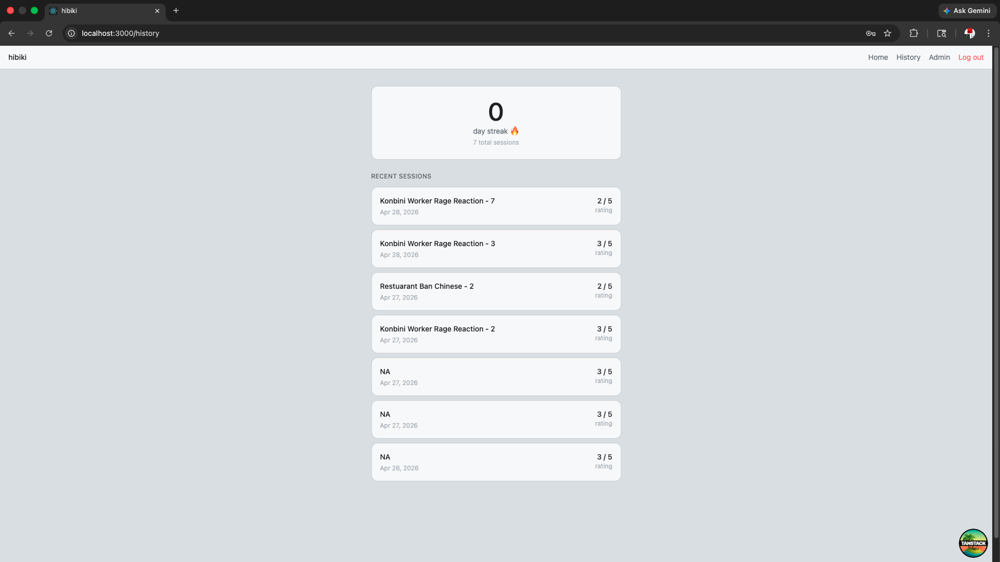
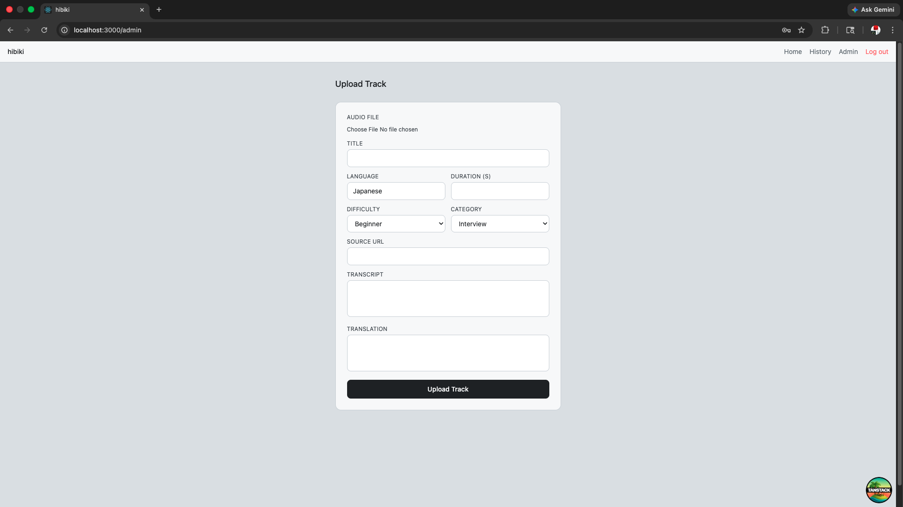

# Hibiki

A language shadowing app for Japanese learners. Browse audio clips, practice shadowing, record yourself, and track your progress over time.

## Features

- **Guest mode** — browse and practice without signing up, history saved locally
- **Free practice** — loop audio, toggle transcript and translation, adjust playback speed, seek controls
- **Record and compare** — record your shadowing attempt and compare it to the original audio
- **Session history** — track completed sessions with self ratings
- **Streak counter** — consecutive days of practice
- **Admin panel** — upload and manage audio tracks

## Screenshots








## Stack

- **Frontend** — Vite + React + TypeScript
- **Routing** — TanStack Router
- **Data fetching** — TanStack Query
- **Backend** — Appwrite (Auth + Database + Storage)
- **Styling** — Tailwind CSS v4 with Light Steel color palette
- **Deployment** — Vercel

## Getting Started

```bash
npm install
npm run dev
```

## Building for Production

```bash
npm run build
```

## Environment Variables

Create a `.env.local` file in the root:

```bash
VITE_APPWRITE_ENDPOINT=https://<REGION>.cloud.appwrite.io/v1
VITE_APPWRITE_PROJECT_ID=your-project-id
VITE_APPWRITE_DATABASE_ID=your-database-id
VITE_APPWRITE_AUDIO_BUCKET_ID=your-audio-bucket-id
```

## Project Structure

```
src/
├── routes/          # TanStack Router file-based routes
│   ├── __root.tsx   # Root layout with navigation
│   ├── index.tsx    # Home page — category cards
│   ├── auth.tsx     # Sign in + guest mode
│   ├── category/
│   │   └── $category.tsx  # Tracks by difficulty
│   ├── player/
│   │   └── $trackId.tsx   # Audio player + shadowing modes
│   ├── history.tsx  # Session history + streak
│   └── admin.tsx    # Track upload panel
├── hooks/
│   └── useAuth.ts   # Auth hooks (useUser, useLogin, useLogout, useSignup)
├── lib/
│   └── appwrite.ts  # Appwrite client setup
└── utils/
    └── calculateStreak.ts  # Streak and date utilities
```

## Database Schema

### tracks

| Column                 | Type    | Required |
| ---------------------- | ------- | -------- |
| audioFileId            | string  | yes      |
| title                  | string  | yes      |
| language               | string  | yes      |
| difficulty             | enum    | yes      |
| category               | string  | yes      |
| duration               | integer | yes      |
| source                 | string  | no       |
| transcript             | string  | yes      |
| transcript_translation | string  | no       |

### sessions

| Column      | Type     | Required |
| ----------- | -------- | -------- |
| userId      | string   | yes      |
| trackId     | string   | yes      |
| trackTitle  | string   | yes      |
| completedAt | datetime | yes      |
| rating      | integer  | yes      |

## Shadowing Modes

**Mode 1 — Free Practice**
Listen and shadow the audio as many times as needed. Loop toggle, speed controls, seek buttons, and transcript toggle available.

**Mode 2 — Record and Compare**
Record yourself shadowing the clip and play it back alongside the original. Rate your attempt 1-5 before marking the session complete.

## Roadmap

### V1.5

- Playback speed expansion (0.5x, 0.75x, 1.25x, 1.5x)
- Loop selected segment
- Streak improvements
- Recently played

### V2

- Admin upload page with auto SRT generation via Whisper
- Video/section grouping for clips
- Leaderboard and user profiles
- Multiple languages
